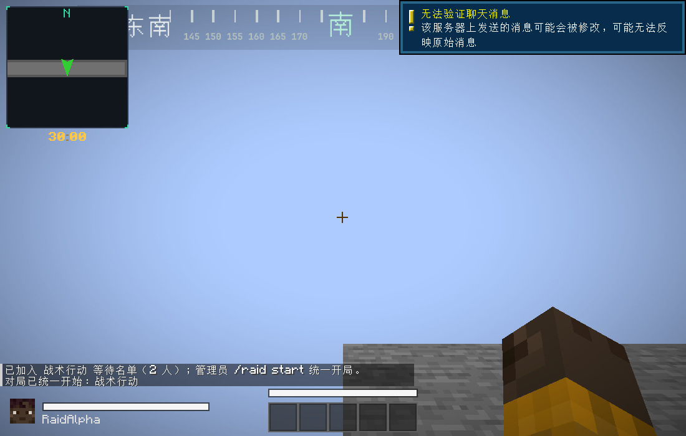
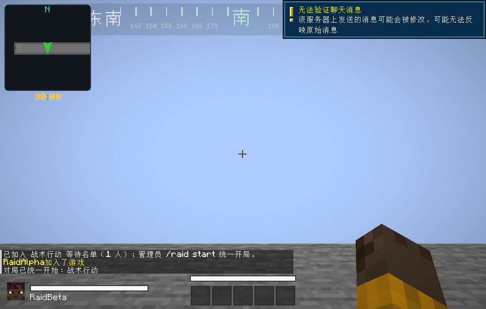

# Herra Core Loop Build 0.1 — M1 共享对局

2026-10-05（Asia/Shanghai）。测试版本 RaidCore 1.1.0。

## 已完成

新增 `RaidMatch`，负责同一局的UUID、固定地图维度、成员名单、统一开始/结束时间、30分钟时钟和 WAITING → STARTING → IN_RAID → FINISHED 阶段。`RaidSession` 继续负责每个成员的撤离、个人行动时间、击杀和一次性结果。服务器每tick只推进一次整局时间。

玩家加入等待不会传送或消耗对局时间。管理员统一开局后锁定名单并分配不同出生点；开局前验证所有成员在线、存活、可参与及出生点有效，传送失败回滚到等待。默认最低2人；可明确配置单人调试。

一人撤离、死亡或断线不会中断其它成员。已结束成员留在本局名单，确认结算也不能重入本局；全员终态后，等待在线成员完成返回大厅再清理共享状态。离线成员不阻塞清理，其结果和待返回大厅标记保留供重登处理。

沿用原模组ID、资源、网络通道、确认协议和存档键，保存格式增加 `schemaVersion=2` 与共享对局/成员信息。保留旧配置和结果读取；重启取消等待或中断在途局，不恢复撤离进度。新增等待HUD、整局状态查询和含raidId/playerUuid/phase/reason的生命周期日志。

原版开发调试命令也叫 `/raid`，其权限谓词会在Brigadier同名合并时保留。本版本注册完整模组命令根，使普通玩家可以加入，管理员子命令仍受权限2约束；实际非管理员客户端已验证。

## 配置与操作

客户端和服务器同时使用 `raidcore-1.21.1-neoforge-1.1.0.jar`，完整重启。原来只有一个出生点的配置需补第二个；单人调试可使用 `/raid minplayers 1`。

先在大厅、两个不同出生位置及撤离点配置：

```mcfunction
/raid lobby
/raid spawn add alpha
/raid spawn add beta
/raid extract add gate 3 5
/raid duration 30
```

以上位置命令分别在对应位置执行；本阶段出生点必须位于同一已加载地图维度，不能重叠。

| 命令 | 行为 |
|---|---|
| `/raid join` | 加入当前等待名单；没有等待局时创建共享局 |
| `/raid leave` | 离开等待；开局后按行动终止退出本局 |
| `/raid status` | 查询整局ID、阶段、维度、成员、剩余时间及自身状态；控制台也可用 |
| `/raid result` | 查看自己的待确认结算 |
| `/raid start` | 管理员统一启动等待名单 |
| `/raid start <玩家选择器>` | 管理员批量登记指定玩家并统一启动，例如`@a` |
| `/raid stop` | 管理员停止整局；已提交结果不被覆盖 |
| `/raid abort [玩家选择器]` | 管理员只终止指定成员 |
| `/raid minplayers [人数]` | 查询或设置最低人数，1–64，默认2 |
| `/raid duration [分钟]` | 查询或设置下一共享局的时长；当前局不被重置 |

## 验证

单元测试共317项、37个测试类，覆盖共同ID、等待冻结、最低人数、统一开局、按tick计时、个人终态、共享超时、禁止重入、释放等待出生点、开局回滚和结果幂等，连同原有测试全部通过。

专用服与两个独立Minecraft客户端使用真实网络连接，脚本控制客户端操作，连续运行4局：

1. 两人加入等待并统一开局；核对共同ID、共同时间、不同出生点、重复tick保护及NBT恢复。A在真实撤离区完成撤离并确认，重入被拒绝；B继续，随后最终死亡、复活、返回并确认。
2. 批量登记开新局，确认新ID及新的30分钟时钟；修改未来默认时长不影响当前局，管理员停止整局。
3. 两人统一启动2秒测试局，在第40个服务端tick共同超时；双方行动时长均为40 tick，并各自确认一次。
4. 再次开始30分钟新局；B断线，A继续参与，然后A终止；整局清理，B的离线结果与待返回标记保留。

三方均需出现对应PASS，退出码不作为单独成功依据：`SHARED_RAID_DEDICATED_PASS`、`SHARED_RAID_CLIENT_ALPHA_PASS`、`SHARED_RAID_CLIENT_BETA_PASS`。同时回归既有 `runServer -PraidCoreSmoke` 和 `runClient -PraidCoreSmoke`，验证原功能与单人调试模式。

日志、构建哈希和测试数量见 [shared-raid-validation.txt](shared-raid-validation.txt) / [shared-raid-results.json](shared-raid-results.json)。





## 原生检查复现

独立目录为 `run-shared-server-smoke`、`run-shared-alpha-smoke`、`run-shared-beta-smoke`；服务器仅监听127.0.0.1:25589。测试服使用已接受的隔离测试EULA，准备平坦测试世界及两个客户端配置。

```powershell
.\gradlew.bat compileIntegrationJava createSharedServerLaunchScript createSharedAlphaLaunchScript createSharedBetaLaunchScript -PraidCoreSharedSmoke
```

生成的三个 `build/moddev/runShared*.cmd` 需要同时运行；先启动专用服，在出现 `SHARED_RAID_SERVER_READY` 后启动两个客户端。初始化脚本位于本地 `.audit/prepare_shared_raid.ps1`。测试窗口隐藏并隔离真实键鼠；检查三方日志PASS。

## 修改范围与后续

主要源码为 `raid/` 的RaidMatch、RaidSession、RaidManager、RaidSavedData、RaidConfig、RaidCommands、RaidDeath，以及 `ui/` 的RaidHud。Gradle加入独立共享测试配置，原生检查仍属于integration源集，不进入正式JAR。

M1完成共享生命周期与对局状态清理。M2的带出物品清单/存储提交、M3的容器/保险箱/地图恢复尚未实现；完整战斗模组组合、真人PVP、实际工厂双人连续两局与异地试玩仍需按审查计划验收。当前测试是脚本驱动的两个真实客户端，不是两名真人的最终人工验收。
