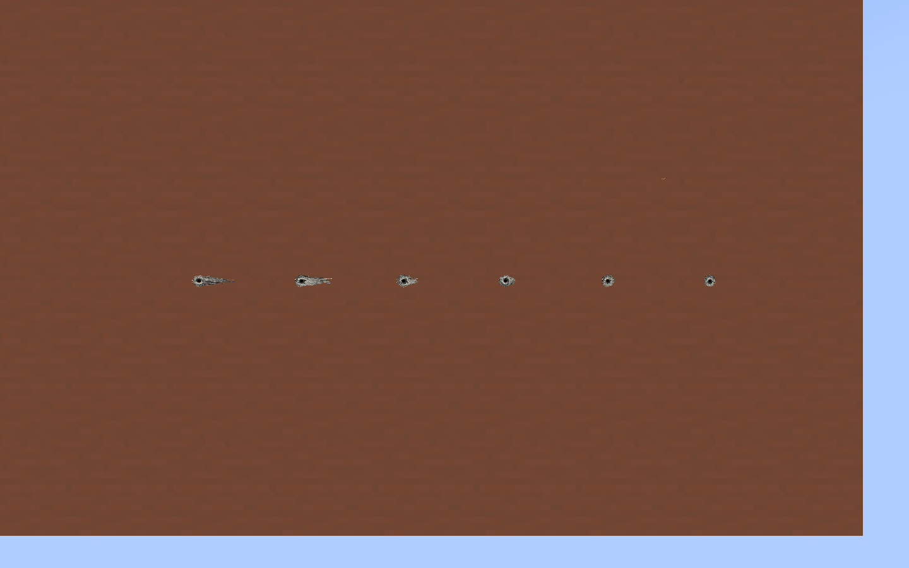
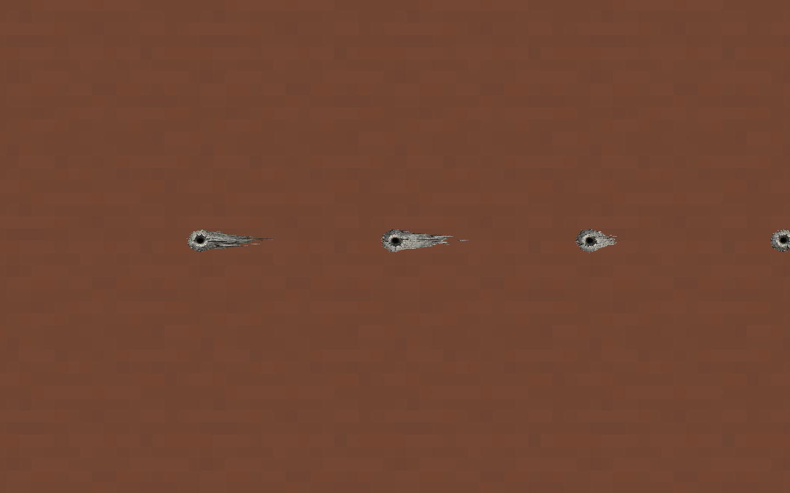
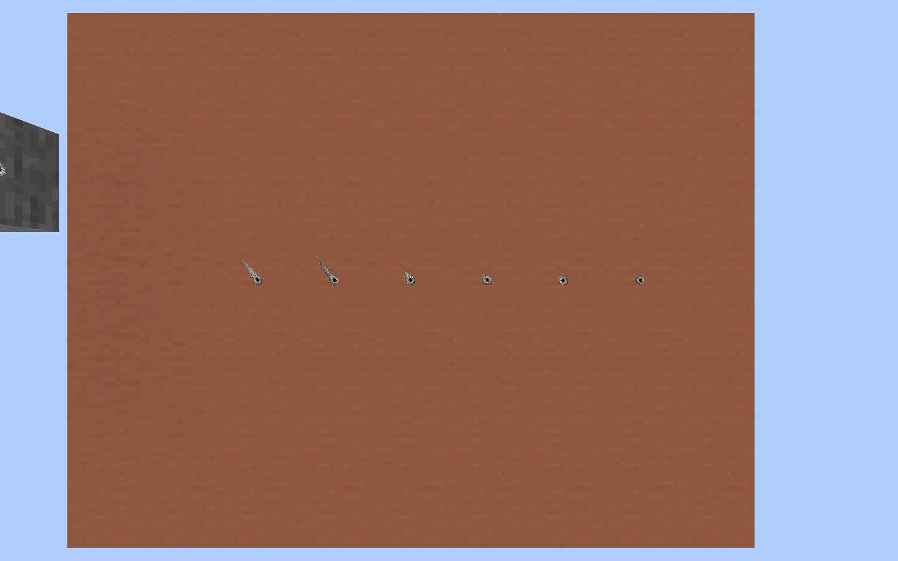
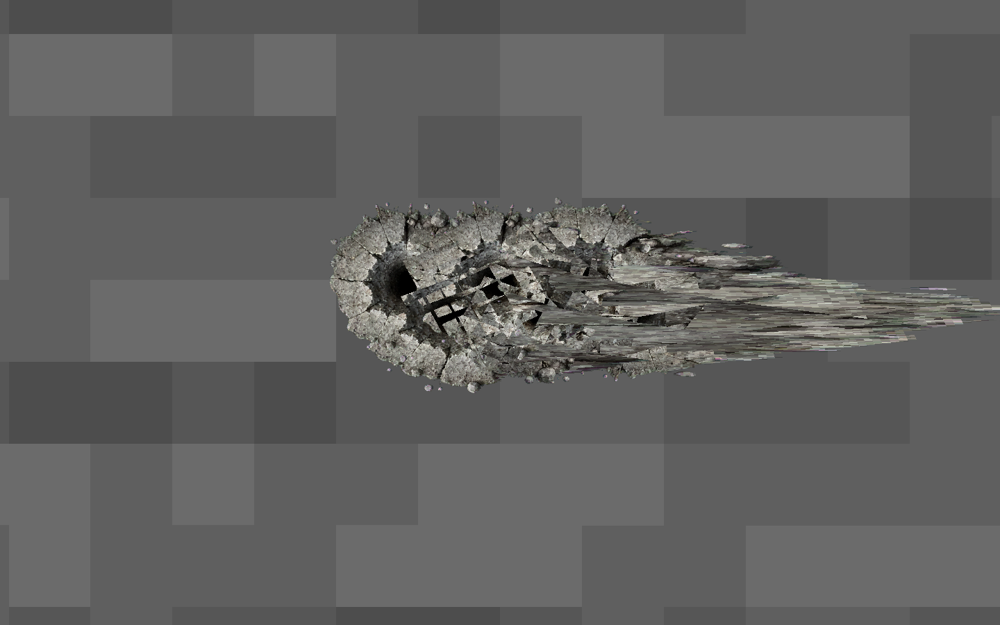
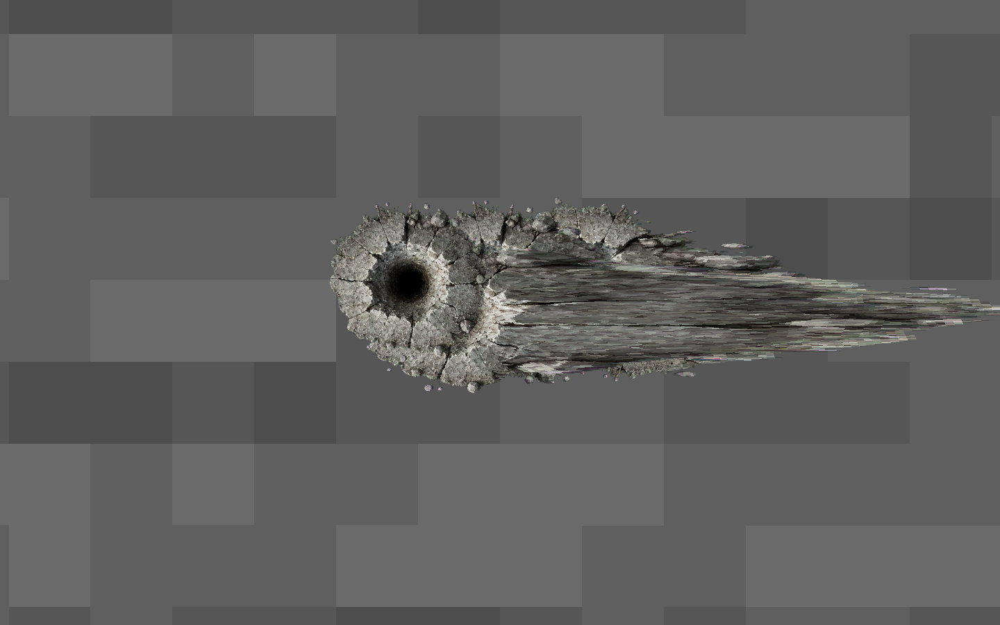

# GWO 入射角弹孔 — RaidCore 1.0.2

弹孔依据服务端实际命中瞬间的子弹速度产生非对称破损。黑色孔口锚定命中点，孔口周围只轻微椭圆化；崩边与划痕沿子弹在表面上的前进方向延伸，来弹一侧保持较短。正射保留原来的圆形弹孔。

原 GWO 贴图划分为 12×12 网格。中心孔口区域的长轴变化限制在约 1.25 倍以内，外缘沿弹道投影方向用平滑函数向前延伸并适当收窄；中心 UV 对应的顶点始终位于原命中位置。`θ` 是弹道与表面法线的夹角，外围破损长度系数为 `min(4, 1 / |cos θ|)`，与孔口的变形分开计算。以子弹表面前进方向计量破损长度时，斜射孔口位于破损区域的起始一侧，正射孔口约为 50%；具体每发位置比例见原生记录。

随机贴图旋转先应用，拖尾再按弹道投影变形，方向随每发子弹改变。全部网格顶点保留原表面平面与深度偏移；边缘按命中点前后各自的可用空间缩放，避免错误地把孔口当成整个破损区域的几何中心。六个朝向、半砖侧面和块边缘使用同一规则。

继续使用 GWO 的材质贴图、UV、缓存光照、渲染阶段、距离淡出、30–60 秒寿命及原有每面 6 / 每区块 48 / 全局 512 数量限制。顶点只在创建弹孔时计算，无逐帧投影计算，不增加贴图、模型或着色器依赖。

## 安装与连接兼容

单人游戏替换为 RaidCore 1.0.2 后即可使用。联机服务端 1.0.1 或更新即可提供真实入射方向，客户端 1.0.2 修正方向及重叠排序；连接更早的服务器时继续显示原来的圆形弹孔。

可选客户端通道 `raidcore:projected_block_impact` 包含原 GWO `BlockImpactPayload` 的全部字段，以及三个有符号 16 位的归一化速度分量，共增加 6 字节。服务端只发送一份弹孔包：支持新通道的玩家收到带方向的包，其它跟踪该区块的玩家收到原 GWO 包。不会同时生成两份弹孔。入射方向完全由服务端子弹决定。

客户端使用受 `try/finally` 保护的短期构建上下文，调用原 `BulletDecalManager.accept`，把生成的网格挂在原弹孔上，并通过原渲染类型和贴图发射细分面片。网格与弹孔一起过期，无独立长期缓存。旧 GWO 包走原路径；无效或缺失方向回退为圆形。GWO 原 JAR 和受保护资源无需修改。

## 实际渲染

独立 NeoForge 客户端使用真实 GWO 子弹 `tick()` 与方块碰撞，再通过本地集成服务器网络发送命中。下图从右至左依次为 0°、30°、45°、60°、75°、89°；墙面长轴水平，地面长轴沿斜向弹道。

## 验证

运行 `./gradlew.bat build` 和 `./gradlew.bat runClient -PraidCoreDecalSmoke`。原生测试在独立 `run-decal-smoke` 中创建平坦测试世界、隐藏窗口并隔离键鼠输入；不会打开用户存档。集成源集不进入发布 JAR。

15 项新增几何测试与原有 272 项测试全部通过。新增测试检查孔口锚点、孔口与崩边的不同变形幅度、前向非对称溅射、反向射击、随机旋转、前后边界和所有网格单元不翻折。原生检查覆盖 21 个实际弹孔：墙面 / 地面六档角度、六个法线朝向、半砖侧面、块边缘和原 GWO 包回退。逐个核验中心 UV 顶点与真实命中点一致、破损沿子弹前进方向偏移、平面、有限顶点和表面边界；另外检查方向编解码、无重复包、方块移除、每面容量及原寿命清理。原生记录见 [decal-geometry.tsv](decal-geometry.tsv)，执行结果与发布哈希见 [validation-results.json](validation-results.json)。

适配版本为 GWO 内部 2.12.87（Beta1.0 Fix0.5）、Minecraft 1.21.1、NeoForge 21.1.251。弹孔大小仍由 GWO 决定，碰撞形状仍由当前弹道系统决定。

## 重叠排序修复（1.0.2）

GWO 原渲染类型只写颜色，不写深度；问题来自透明面片的距离排序。12×12 网格的每个小面片被单独排序后，不同弹孔的面片交叉混合，在黑色孔口中出现三角碎块。仅关闭弹孔类型的 `sortOnUpload`，完整弹孔按 GWO 原队列顺序逐层叠放；保留原深度测试、shader、贴图及其它特效排序，无额外法线偏移。

原生检查 `./gradlew.bat runClient -PraidCoreDecalOverlapSmoke` 在独立测试 JVM 中临时启用旧排序，使用同一组实际弹孔、同一镜头取得对照，再恢复修复状态。墙面与地面各六个密集命中，包含圆形与网格混合；固定镜头的修复画面逐像素一致。结果见 [decal-overlap-results.txt](decal-overlap-results.txt)。

