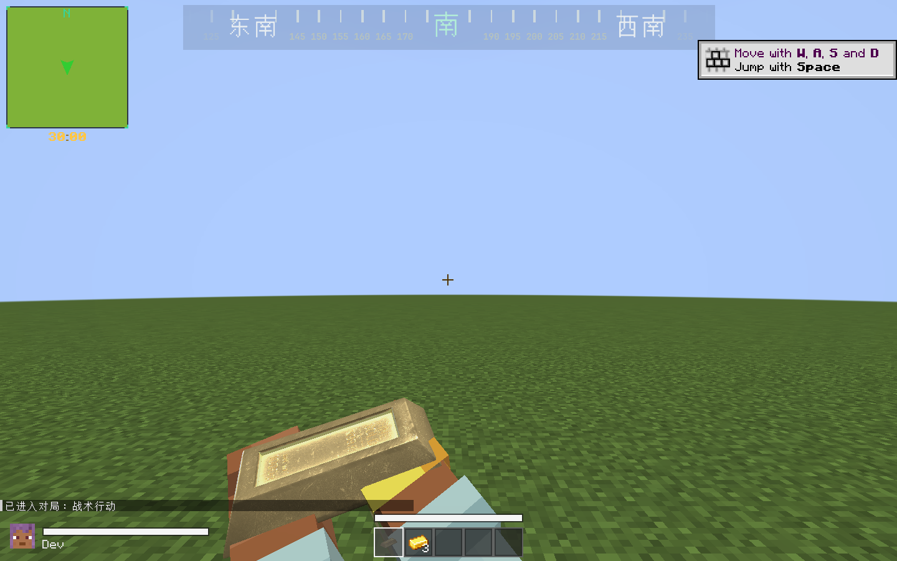
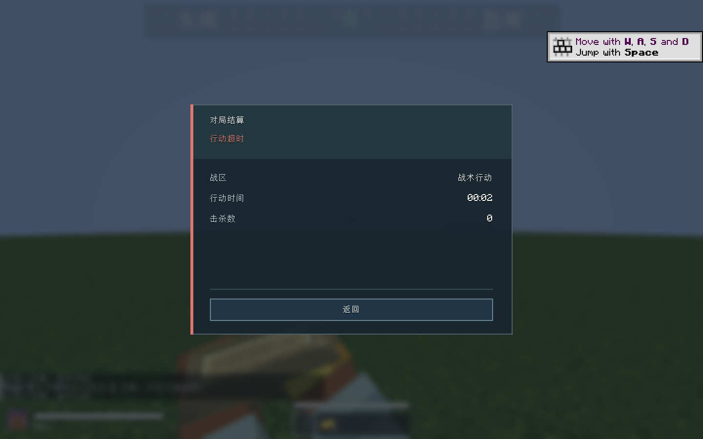

# Raid 对局倒计时 — 1.0.4

2026-10-05（Asia/Shanghai）。

入场后，小地图下方从 `30:00` 开始显示整局剩余时间，保留金色数字、居中位置、秒位脉冲和最后60秒的红色提醒。大厅与普通世界不自动开始；撤离点的停留时间保持独立，离开或切换撤离点不重置整局时间。

服务端推进对局时钟，默认1800秒（36000 tick）。归零时记录 `TIMED_OUT`，自动返回大厅并显示“行动超时”结算；截止 tick 上才完成的撤离按超时处理。死亡、撤离、终止和断线沿用原结算规则，且不会重复结算或覆盖已提交结果。服务端暂停时对局时钟暂停；客户端最多预测5个 tick，延迟或暂停不会自行触发超时。

管理员 `/raid duration` 查看当前默认时长；`/raid duration <分钟>` 设置1–1440分钟，仅影响后续入场。配置及每局入场时长随世界数据保存，旧存档缺少字段时默认30分钟。客户端旧 `general.match_timer_seconds` 仅用于 `/map timer reset` 手动计时；Raid 使用服务端时长，手动命令无法覆盖进行中的对局时钟。外部 `TacticalMapApi.registerTimerProvider` 仍优先于内置 Raid 计时。

## 验证

- `gradlew.bat build`：300项单元测试、35个测试类全部通过。覆盖完整36000 tick 超时、截止 tick 撤离冲突、结束结果幂等、撤离进度与整局计时隔离、恢复时长、客户端同步与停顿、Provider 优先级。
- `gradlew.bat runServer -PraidCoreSmoke`：真实专用服务器启动；验证配置与对局时长 NBT 往返、旧存档30分钟回退、新超时结果与管理员指令。出现 `RAIDCORE_RAID_TIMER_SERVER_PASS` / `RAIDCORE_SERVER_SMOKE_PASS`。
- `gradlew.bat runClient -PraidCoreSmoke`：独立平坦测试世界使用真实快照驱动小地图；验证30分钟入场、修改默认时长不重置当前局、终止/确认、超时返回大厅、再次入场与断线清理。测试局设为2秒，在第40个服务端 tick 自动超时；完整30分钟边界由单元测试验证。出现 `RAIDCORE_RAID_TIMER_CLIENT_PASS` / `RAIDCORE_CLIENT_SMOKE_PASS`。
- 发布 JAR 检查：唯一 `raidcore` 入口、完整资源与 Mixin，不包含集成检查类、单元测试或第三方二进制。

日志与构建哈希见 [raid-timer-validation.txt](raid-timer-validation.txt) / [raid-timer-results.json](raid-timer-results.json)。

