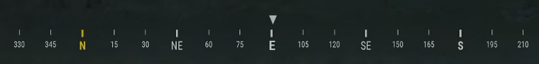
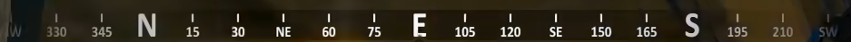

# 方位条 HUD（罗盘）

> 模组：Drag Inventory · Minecraft 1.21.1 · NeoForge 21.1.251 · LDLib2 2.2.40
> 自 v1.5.0 引入，当前版本 v1.5.5

屏幕顶部中央的方位罗盘条：实时显示朝向度数，两侧滚动显示方位文字与角度刻度，并把你打下的战术标点、死亡落包点投射到对应方位上。支持五套游戏风格皮肤、六组配色、六页签图形化设置界面，全部选项即时生效。


---

## 目录

1. [功能总览](#功能总览)
2. [快速上手](#快速上手)
3. [五套皮肤](#五套皮肤)
4. [六组配色](#六组配色)
5. [设置界面](#设置界面)
6. [指令参考](#指令参考)
7. [战术标点联动](#战术标点联动)
8. [死亡标点](#死亡标点)
9. [动画与手感](#动画与手感)
10. [配置文件参考](#配置文件参考)
11. [常见问题](#常见问题)
12. [开发者联动接口](#开发者联动接口)
13. [版本历史](#版本历史)

---

## 功能总览

| 能力 | 说明 |
| --- | --- |
| 顶部方位条 | 中央大号当前度数，两侧主方位文字（北/东北/东…）与角度刻度向反方向流动 |
| 五套皮肤 | 三角洲、绝地求生、Apex（v1.5.5 起默认）、战地、使命召唤，按各游戏原作还原 |
| 六组配色 | 极光 / 霜白 / 琥珀 / 绯红 / 紫罗兰 / 石板，可逐项覆盖任意颜色 |
| 图形化设置 | `/com` 三个字母唤出：六页签单屏容纳全部选项，顶部实时预览 |
| 标点联动 | 战术标点自动映射到方位条：敌对红感叹号、位置白菱形、物资物品贴图 |
| 死亡标点 | 死亡自动标记落包点，重生后沿方位条导航，靠近 8 米自动消失 |
| 屏外提示 | 视野外侧的标点吸附到条带边缘、压暗并带方向箭头 |
| 按键开关 | 可在按键设置绑定"开关方位条"（默认未绑定） |
| 指令控制 | `/com`、`/compass`、`/herracompass` 三条根指令，18 个子命令 |
| 联动接口 | `CompassApi` 静态门面，供其他模组读取朝向、注册标点、监听方位事件 |
| 独立组件 | 独立 HUD 图层注册，不修改快捷栏 / 体力血条 / 枪械 HUD 的任何行为 |

方位条与游戏内其他 HUD（快捷栏、血条体力、枪械 HUD）完全独立：默认位置在顶部中央，不会互相遮挡；如需微调，布局页签里可以拖拽定位或输入精确偏移。

## 快速上手

1. **安装**：把 `drag-inventory-1.21.1-neoforge-1.5.4.jar` 和 LDLib2 2.2.40 放进 `mods` 文件夹。
2. **进入世界**：方位条默认开启，出现在屏幕顶部中央。
3. **调整**：聊天栏输入 `/com` 回车，三个字母即可唤出设置界面；所有改动实时预览、即时保存。
4. **开关**：`/compass toggle`，或到 选项 → 控制 → Drag Inventory 绑定"开关方位条"按键。
5. **体验标点**：游戏内中键单击标记地点，看它出现在方位条对应方位；`/compass test enemy` 可快速生成测试标点。

> 朝向规则：0° = 北，顺时针增大（90° 东、180° 南、270° 西），与 F3 显示一致。

## 五套皮肤

设置界面 **外观** 页签或 `/compass style <id>` 切换。五套皮肤共享布局与标点逻辑，只在背景、刻度、读数的画法上还原各自原作。

### delta —— 三角洲行动（v1.5.5 前默认）

顶部贯穿基线，刻度从基线垂挂（15° 粗刻度、5° 细刻度）；八方位点显示方位词（"北"为金色），其余 15° 位显示三位补零度数（015/030/…）；当前朝向以 **[ 37 ]** 方括号大读数嵌在条带中央，读数下方一枚下指三角。


### pubg —— 绝地求生

顶部白色下指三角固定在屏幕中心（无度数框）；其下是半透明深色条带与刻度带——字母位刻度粗、数字位刻度细，**N 的刻度为金色**；文字带在最下方：N/E/S/W 大号加粗（**N 金色**），斜方位中号，度数小号银灰。两端硬截止，无渐隐。



### apex —— Apex 英雄（v1.5.5 起默认）

悬浮式布局，无条带无读数框：八方位点全部大号字母，与角度数字共用底基线；数字上方一根细刻度，字母位无刻度、无 5° 次级刻度；两端 Alpha 渐隐，仅一层极轻压暗保证亮天空下可读。视觉上最"轻"的一套。



### battlefield —— 战地

无底色丝带：一根基准线 + 两端 L 形包角 + 顶部小三角。条带下方是放大的度数读数（战地 HUD 中最显眼的元素），标点行下移避让。整体存在感最低，适合追求极简的玩家。

### warzone —— 使命召唤

圆角半透明条带；顶部白色下指三角 + 条带下方单行"方位名 + 度数"读数（如 `北 353`），文字阴影无底衬。中央读数块是整套皮肤的视觉锚点。

## 六组配色

`/compass palette <id>` 或设置界面 **颜色** 页签切换：

| id | 名称 | 气质 |
| --- | --- | --- |
| `aurora` | 极光 | 青绿高亮（默认） |
| `frost` | 霜白 | 冷白蓝调 |
| `amber` | 琥珀 | 暖金黄 |
| `crimson` | 绯红 | 战术橙红 |
| `violet` | 紫罗兰 | 高饱和紫 |
| `slate` | 石板 | 低饱和灰蓝 |

配色可与任意皮肤自由组合。颜色页签内置 HSL 取色器（彩虹色相条），`accent`（中心高亮）、`text`、`dim_text`、`tick`、`background` 五个通道都可逐项覆盖；恢复默认即时回退。标点颜色由撞色规避算法保障，永远不会和 accent 融为一体（见[战术标点联动](#战术标点联动)）。

## 设置界面

聊天栏输入 **`/com`**（或 `/compass`、`/herracompass`）唤出。像素游戏风面板、六页签单屏容纳全部选项，消灭长滚动列表：

| 页签 | 内容 |
| --- | --- |
| 外观 | 皮肤、透明度、缩放、主方向字号、中文方位字开关 |
| 布局 | 位置偏移、条带宽度（120~960）、全屏拖拽定位、快捷对齐、屏宽占比预设 |
| 显示 | 显示视野范围、小刻度/数字间隔、主方位/次方位/数字开关、F3 隐藏 |
| 标点 | 标点总开关、战术标点桥、死亡标点、距离/文字标签、脉冲、测试标点 |
| 动效 | 弹簧刚度、吸附辅助、惯性倾斜、入场动画 |
| 颜色 | 配色选择、五通道 HSL 取色器、菜单主题 |

界面要点：

- **实时预览**：顶部演示框与 HUD 走同一条渲染路径——可拖拽转向、拉"模拟朝向"滑杆、开启自动摆动；演示始终居中于演示框内，极端参数也不会溢出（v1.5.3）。
- **全屏拖拽定位**（布局页签）：进入后直接拖动真实 HUD，蚂蚁线高亮 + 坐标读数，滚轮调条宽；配合四向快捷对齐（水平居中/贴顶/贴左/贴右）与屏宽占比四档预设（1/6 ~ 2/3 屏）。
- **菜单主题**：琥珀（默认）/ 科技 / 绯红三套，配色页签可切换。
- **每行 ↺ 按钮**：单项恢复默认，不用整机重置。
- **即时保存**：改动 500 毫秒静默后统一落盘，退出世界/关闭界面兜底写入；v1.5.2 修复了保存竞态，开关、配色不会再"跳回去"。

## 指令参考

三条根指令等价：`/com`（最短）、`/compass`、`/herracompass`。根指令不带参数 = 打开设置界面。

| 子命令 | 说明 |
| --- | --- |
| `gui` | 打开设置界面 |
| `toggle` / `on` / `off` | 开关方位条 |
| `style <id>` | 皮肤：`delta` `pubg` `apex` `battlefield` `warzone` |
| `palette <id>` | 配色：`aurora` `frost` `amber` `crimson` `violet` `slate` |
| `offset <x> <y>` | 位置偏移（像素，±640） |
| `scale <v>` | 整体缩放 0.5 ~ 2.0 |
| `opacity <v>` | 透明度 0.15 ~ 1.0 |
| `width <px>` | 条带宽度 120 ~ 960 |
| `range <deg>` | 显示视野范围 60° ~ 360° |
| `smooth <v>` | 弹簧刚度 4 ~ 34（越大越跟手，默认 15） |
| `markers <on/off>` | 标点联动开关 |
| `test enemy` | 前方 15° 生成红色敌对标点（测试） |
| `test location` | 正前方生成位置标点（测试） |
| `test item` | 后方 15° 生成物资标点（测试） |
| `test clear` | 清除全部测试标点 |
| `copy` | 当前朝向 + 方位名复制到剪贴板（如 `206° 西南`） |
| `info` | 查看当前朝向、方位名、皮肤、配色与活动标点数 |
| `reset` | 恢复全部默认配置 |

非法参数会报错并列出全部合法值（如 `/compass style xyz` 不会静默回退）。测试标点 60 秒自动过期，退出世界自动清空。

## 战术标点联动

方位条**只读接入**现有战术标点体系（中键单击/双击打点），不改变标点本身的任何行为——打的点还是原来的点，只是多了一份额外的方位指示。

标点图形与游戏内实际标点同款，不读字即可区分含义：

| 类型 | 图形 | 来源 |
| --- | --- | --- |
| 敌对 | 红色感叹号（#FF4949） | 中键双击任意位置 |
| 位置 | 白色菱形（暗衬） | 中键单击地面 |
| 物资 | 物品原生动图标 | 中键单击掉落物 |
| 死亡 | 红色 X 十字 | 自动生成（见下节） |

行为细节：

- **距离显示**：标点下方显示实时整数米数（`12m`）；可在标点页签切换 仅距离 / 标签+距离 / 仅标签。
- **脉冲**：标点按创建时刻相位平滑呼吸，不会随机抖动。
- **屏外吸附**：转到视野外侧不远（方位差在半视野 ~ 全视野之间）的标点，钳制到条带对应边缘、压暗提示"视野外不远处"；几乎在正背后的标点（方位差 > 显示范围）不显示，避免两端长期堆满图标。
- **方向箭头**：边缘吸附的标点内侧画 ◄ / ► 小箭头，指示转向方向。
- **撞色规避**：标点颜色与当前 accent 做色相距离校验（≥ 0.14），过近时自动旋转色相并提高饱和度——绯红配色下的红色敌对标点会自动变为蓝青色，依然醒目。
- **同步**：测试标点 60 秒过期（与战术标点生命周期一致），被遮挡、失效的标点逐个复检后移除；世界切换自动清空。

## 死亡标点

死亡瞬间自动在死亡位置生成红色 X 标点（同维度才显示——跨维度坐标没有导航意义）：

1. 死亡 → 落包点标 X，脉冲呼吸，带"死亡点"标签与距离；
2. 重生 → 沿方位条导航，X 始终指示死亡点方向；
3. 活着且靠近 8 米内 → X 自动消失（死亡瞬间人在死亡点上，不会"生成即消失"——清除判定只对活着的玩家生效）。

死亡动画期间就生成标点，任意死亡路径（摔落/击杀/指令）都可靠。标点页签 `markers.death` 可关闭。

## 动画与手感

- **临界阻尼弹簧**：度数滚动用精确闭式解驱动——无过冲、无余振，急转后约 0.5 秒自然停在目标角度；弹簧刚度可调（`smooth` 4 ~ 34）。
- **跨零最短路径**：359° ↔ 0° 来回跨越走最短角路径，条带绝不反向甩动；角度连续（358 → 359 → 0 → 1）。
- **亚度精度**：朝向保留浮点精度，慢转向时刻度子像素平滑，无 ~2px 步进跳变。
- **吸附辅助**：接近正北/东/南/西时中心读数轻微吸附（范围可调，可关闭）。
- **惯性倾斜**：快速转向时条带轻微倾斜的装饰动效（强度可调，可关闭）。
- **入场动画**：从上方 8px 缓入滑落 + 淡入（可关闭）；只有真实"不可见 → 可见"切换才重播，拖滑条不会闪烁。

## 配置文件参考

配置位于 `config/draginventory-client.toml`，修改即时生效（500ms 防抖落盘），设置界面 / 指令 / 手改文件三方同步。常用键：

```toml
[compass]
enabled = true                 # 总开关
style = "apex"                 # 皮肤（v1.5.5 起默认，旧默认 delta）
palette = "aurora"             # 配色
offset_x = 0                   # 位置偏移（±640）
offset_y = 0                   # 顶部对齐（v1.5.5 起默认，旧默认 6）
width = 427                    # 条带宽（120~960；v1.5.5 起默认 427 ≈ 2/3 屏宽，旧默认 240）
scale = 1.0                    # 整体缩放（0.5~2.0）
opacity = 1.0                  # 透明度（0.15~1.0）
range = 120                    # 显示视野范围（60~360）
smoothness = 15                # 弹簧刚度（4~34）
hide_with_debug_screen = true  # F3 时隐藏
menu_theme = "amber"           # 菜单主题 amber/tech/crimson

[compass.marker]               # 标点：enabled/tactical/death/show_distance/show_labels/pulse/test_markers
[compass.color]                # 颜色覆盖：accent/text/dim_text/tick/background（默认跟随配色）
[compass.ticks]                # 刻度：minor_step/number_step/show_cardinals/show_intercardinals/show_numbers/cjk_labels/cardinal_scale
[compass.motion]               # 动效：snap_assist/snap_range/inertia_tilt/tilt_intensity/entry_animation
```

> 手改文件后回到游戏会自动热重载；v1.5.2 起重载与内存修改自动对账，不会互相覆盖。
>
> **v1.5.5 出厂预设重调**：默认皮肤 delta → apex、顶部对齐（offset_y 6 → 0）、条宽 240 → 427（640 GUI 宽的 2/3 屏）。老玩家升级后首次加载时**一次性收敛**：仅把仍为旧默认值的项换成新默认，玩家自定过的项一律保留；此后再改回旧值的选择被永久尊重（`general.defaults_retuned` 标记驱动）。

## 常见问题

**看不见方位条？**
确认 `enabled = true`（`/compass on`）；检查透明度是否被调到最低；F3 调试屏打开时默认隐藏（可配）；按键开关是否被误触（动作栏有提示）。

**次方位字母和度数偶尔重叠？**
v1.5.3 起内置碰撞检测：字母与数字过近时自动跳过该数字（细刻度保留），五套皮肤通用。若仍觉拥挤，把 显示 页签的"数字间隔"调大一档即可。

**设置改了没保存 / 开关跳回去？**
v1.5.2 已根因修复（NeoForge 配置文件监视线程与内存修改的竞态）。若使用旧版本遇到此问题，更新到 1.5.4 即可。

**敌人标点不消失？**
标点 60 秒自动过期；被遮挡/失效的标点逐帧复检移除。若测试标点残留，`/compass test clear` 清空。

**与其他 HUD 重叠？**
方位条默认顶部中央，与快捷栏/血条/枪械 HUD 无交集。如自定义后重叠，布局页签 → 全屏拖拽定位，或 `/compass offset <x> <y>` 精确调整。

**标点颜色和主题撞色看不清？**
撞色规避算法会自动旋转标点色相。若自定义了极端灰度配色仍不满意，颜色页签单独调 `accent` 或换个配色即可。

**联机需要服务端装吗？**
方位条是纯客户端功能，服务端不需要；但模组整体的体力/生命规则要求服务端同装（详见主 README 安装章节）。

## 开发者联动接口

其他模组可**反射探测** `dev.draginventory.client.compass.CompassApi`（无编译期硬耦合，未安装时安全降级）：

```java
float heading = CompassApi.getSmoothHeading();   // 平滑朝向 [0, 360)，未初始化返回 -1
float omega   = CompassApi.getHeadingVelocity(); // 角速度（度/秒，右转为正）
CompassApi.registerMarkerProvider(provider);     // 注册外部标点源（小地图路径点、队友方位等）
CompassApi.addCardinalListener(deg -> { ... });  // 进入 北0/东90/南180/西270 区域的边沿事件
```

- 标点提供者只需实现 `CompassMarkerProvider`：`void collectMarkers(Context ctx, Consumer<CompassMark> out)`，每帧渲染前调用，实现应轻量并自行缓存；单提供者异常自动隔离，不会拖垮 HUD。
- 基数方位事件为边沿触发（进入时发一次，基于真实视角而非平滑值）：快速扫过正北也会触发，离开后重进会再次触发；区域半径由 `snap_range` 决定，关闭 `snap_assist` 时不触发。
- 所有方法在方位条禁用时不抛异常，返回安全默认值。

## 版本历史

| 版本 | 变更 |
| --- | --- |
| v1.5.5 | 出厂预设重调（用户实测反馈默认观感不佳）：默认皮肤 delta → apex（悬浮式、两端渐隐、视觉最轻）；顶部对齐 offset_y 6 → 0；条宽 240 → 427（640 GUI 宽下 2/3 屏宽预设值）；老玩家存量配置首次加载一次性收敛（标记驱动，玩家自定值保留） |
| v1.5.4 | `/compass info` 修复：占位符未被数值替换（实参/占位符不匹配 + %d 非法说明符）；18 个子命令全量审计无其他问题 |
| v1.5.3 | 次方位字母/度数碰撞自动避让（五皮肤）；菜单内容区剪裁，翻页不再盖页签；预览演示居中 + 盒内防溢出 |
| v1.5.2 | 配置保存竞态根因修复；标点与实际战术标点同款图标 + 60s 过期同步；全屏拖拽定位 / 快捷对齐 / 屏宽预设 / 刻度密度自适应；三套菜单主题 |
| v1.5.1 | 按用户参考图逐像素还原三角洲 / PUBG / Apex 三套皮肤；刻度标签坐标空间修复（任意 offset 正确）；设置界面 Mythic 化 + 每行单项恢复默认 |
| v1.5.0 | 初版：五套游戏风格皮肤、六页签像素风设置界面（`/com`）、标点联动、死亡标点、按键绑定、`CompassApi` |
| v1.4.9 | 方位条随模组 v1.4.9 之后的内部迭代首次亮相前的最后一版基础（战术标点体系定型） |

> 完整开发过程与技术细节见 `docs/compass-hud.md`（开发交付文档）；模组整体介绍见主 `README.md`。

---

*Drag Inventory · kujojotarojojo · MIT License*
