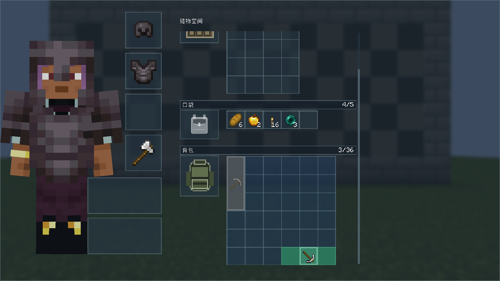
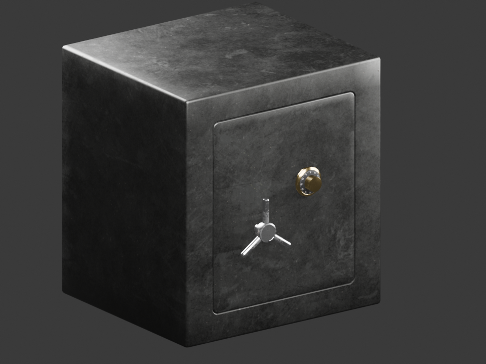

# 战术多格背包与搜打撤框架 1.0.20

Minecraft 1.21.1 / NeoForge 21.1.251 / Java 21，界面由 LDLib2 构建。

由 HerraStudio 维护，采用 MIT 许可证。

[GitHub 仓库](https://github.com/HerraStudio/tactical-inventory) · [下载 Release](https://github.com/HerraStudio/tactical-inventory/releases/latest) · [提交问题](https://github.com/HerraStudio/tactical-inventory/issues)



[版本记录](CHANGELOG.md) · [测试与验证](docs/VALIDATION.md) · [搜打撤配置](docs/RAIDS.md) · [项目交接](docs/HANDOFF.md)

## 安装

将 `tactical-inventory-1.21.1-neoforge-1.0.20.jar` 放入游戏实例的 `mods`，替换旧版 Tactical Inventory，避免重复加载。本次增加金条战利品模型、Blender MCP 动作和 GWO 检视；保留稀有度配置、破译、开门、搜打撤、背包协议 2 及原物品存储。联机双端更新，LDLib2 2.2.40+（2.2.x）也需安装在服务器。
需要 NeoForge 1.21.1 版 GWO，内部版本 `2.12.87`；客户端还需要 LDLib2 `2.2.40+`（2.2.x）和 Photon `2.2.7+`（2.2.x）。GWO 的展示版本名称可能不同，以模组内部版本为准。
现有 Drag Inventory、GWO Pickup、ItemPhysic Lite、CreativeCore 可照常保留；它们不属于本项目发布包。不要重复安装这些模组。
仓库与 Release 不包含 GWO JAR、授权内容包或游戏存档。编译时的本地依赖准备见 [libs/README.md](libs/README.md)。

## 金条与战利品检视（1.0.19）

`tactical_inventory:gold_bar` 默认金色传说品质、1×1、不堆叠。持有时按 GWO 的检视键（默认 I），或右键空处，播放由 Blender MCP 制作的翻转动作，支持自己的皮肤与左右主手。使用 GWO 的模型缓存、GPU 渲染和动画采样，提供 Iris PBR 材质及无光影烘焙图。保险箱奖励独立 25% 概率生成，也可在创造栏或通过 `/give` 取得。[模型、操作及源文件](docs/LOOT_MODELS.md)。

## 稀有度与占格配置（1.0.18）

点击战术背包顶部“物品配置”，或使用 `/tacticalitems`，设置普通白、精良绿、稀有蓝、史诗紫、传说金和物品占格宽高（各 1–6 格）。LDLib2 菜单支持搜索、整体占格及放大图标预览、旋转预览、保存与恢复默认。管理员按世界统一配置并同步所有玩家，普通玩家可以只读预览；GWO 支持具体型号配置。

物品边框、名称与背景光效按稀有度显示，尺寸与原拖拽和服务端校验共用；放不下的原有物品安全保存到待整理区。[使用说明](docs/ITEM_PROFILES.md)。

## 搜打撤对局（1.0.14）

管理员在地图内通过命令配置大厅、一个或多个出生点、方形撤离区域；玩家使用 `/raid join` 进图出生。撤离点持续播放内置的 Photon 绿色烟雾，进入区域后屏幕顶部显示“即将撤离”、数字倒计时和进度动效。默认连续停留 20 秒，离开或更换撤离区重新计时。服务端决定撤离结果，成功后带现有战利品返回大厅并显示结算。

对局内死亡保留所有近战武器，其余装备和物资掉落，包括快捷栏、护甲、副手、胸挂、背包及其储物区；此规则覆盖 `keepInventory`。GWO 近战、剑、斧及 `tactical_inventory:melee` 标签物品被保留，完整组件不丢失。原刀鞘近战仍在原槽；因背包或胸挂掉落而失去容量的储物区近战进入现有“待整理”区。玩家正常复活后返回大厅，显示死亡结算。

## 战术破译（1.0.17）

看向附近未开启的保险箱，按 F 打开深蓝科技线框的 LDLib2 界面，空格或左键在绿色弧区判定。成功 3 次解锁，绿区逐步缩小、指针加速；失误 3 次失败并冷却 3 秒。破译时锁定移动、武器/道具操作，机械噪音可被附近玩家听见；受伤会抖动并可能中断。服务端生成种子，通过 `@DescSynced` 管理字段同步，重算每次判定，客户端不决定结果。

奖励一次生成到箱内，播放原开门动作后搜刮，保留原箱内物品；关闭、离区和断线重置进度。已开启箱永久敞开，重新放置已解锁箱也不会刷新奖励。[完整规则](docs/SAFE_CRACK.md)。

结算显示结果、战区、行动时间和击杀数，按返回或 Esc 确认并恢复鼠标。配置和每名玩家最新结果按世界保存；断线或服务器重启将未完成对局标为中断，重登返回大厅，不继承撤离进度。未配置完整地图时不自动开始对局。[完整命令与配置示例](docs/RAIDS.md)。

## 物品替换与自动旋转（1.0.13）

参考提供的视频：拖入物品按其完整占格覆盖目标区域，被覆盖的一件或多件物品自动回填到可用空间，不会交给鼠标继续拖，也不会移动未覆盖的物品。优先将覆盖布局按“来源旧根格 − 移入新根格”平移回来源区域；精确位置不合适时自动寻找附近位置并尝试旋转，必要时回溯调整，直到所有物品都能合法放下。来源区域无法接纳时可在目标区域找空位，不使用无关空间或“待整理”区。自身背包与支持的搜刮容器之间也可交换。

完整布局可行时预览绿色，无法回填时红色，松手不改原布局。服务端从真实物品、当前修订号和槽位规则重新计算整笔事务；全部合法后一次提交，保留数量、枪械弹药、附件、名称与其他组件。相同组件且未满的堆叠优先合并；满堆可整体替换。实际拆出部分且原处有余量时保留源占格，只允许空位放置或合并，避免把剩余源物品当空位。

每次拿起物品以原方向为首选。当前位置首选方向放不下时自动尝试另一方向，回到首选方向能放下的位置时自动恢复。浮图、高光、实际占格与图标的 90° 旋转同步，放下后的图标保持该方向。R 可以选择手动首选方向；固定装备槽保持类型与数量限制，胸挂保持独立小袋规则。非空胸挂/背包装备的容量替换继续原有专门校验，右键半组不交换这类装备。

只接管本项目既有的原版箱子、陷阱箱、双箱、木桶和保险箱。未搜刽物品不能覆盖或重排。容器物理槽数与堆叠上限同样参与检查；大堆放入容器时只放其可容纳的数量，余量留在原位置。第三方专用容器的独立过滤规则不属于预览兼容范围，服务端仍会安全拒绝不合法写入。

## 多格整体拖拽（1.0.12）

多格物品始终作为一个完整矩形。拿起时从物品根格和网格起点（含滚动量）记录整体左上角，并保存鼠标相对整体锚点的偏移；点击右下角或中间任何一格都不会把该格当成物品根格。图标以鼠标减去整体偏移为依据，一次绘制整件物品，保留原绘制内边距与尺寸。多格浮图直接响应当前鼠标，避免动画滞后影响锚点观察；单格物品继续原有平滑跟随。

放置预览和实际点击/松手放置共用同一个目标解析器：以当前鼠标和整体偏移反推出物品左上角，再吸附到最近的根格。预览按完整占格显示绿/红，发送相同根格坐标，由原服务端检查整个区域。越界时不自动移回网格边缘。合并物品按反推根格的实际占用物查询，不再误用鼠标所在格的物品。R 旋转保留抓取位置相对于整件宽高的比例；固定装备/口袋仍沿用原槽位命中，单格、拆半、Shift 转移、Q 和存储规则不变。

## 拖拽显示与配色（1.0.11）

单格图标继续记录鼠标相对实际图标绘制框的偏移，从原来的位置和尺寸开始悬浮，再平滑跟随鼠标，不瞬间跳到鼠标中心；多格物品使用上节的整体锚点。浮图没有跟手背景、边框、阴影或数量，不吸附网格；按 R 旋转时保留归一化抓取偏移。原槽位图标及数量继续绘制，覆盖半透明灰色遮罩；放下、取消或无效拖拽松开后遮罩移除，物品显示沿用服务端实际状态，不改动客户端物品数据。

网格内同时显示独立的放置预览，按旋转后的实际占格尺寸显示（例如 5×2 或 2×5）。多格物品使用整体偏移反推的目标根格；单格沿用鼠标命中的目标格。可放置为半透明绿色，空间不足、重叠、错误栏位等为半透明红色；使用原有放置校验结果，不修改网络或存储规则。固定装备、口袋的预览覆盖对应目标栏位，网格预览按原视窗裁切；鼠标移出目标区域后仍可自由移动图标。

背包网格槽底为 `#223A54`，保留约 63% 不透明度；边框保持原样，文字保持纯白。胸挂、口袋、独立装备和搜刮区沿用原有配色。

胸挂、口袋、背包统一使用 28×28 连续格子，没有格缝，只保留与保险箱相同的细分隔线。胸挂原有分袋放置规则和口袋限制保持不变，点击区域随绘制尺寸同步。

## 容量与连续网格（1.0.9）

“战术胸挂”统一改名为“胸挂”。胸挂、口袋和背包顶部使用带细边框的横向长条，左侧显示名称，右侧实时显示已占用格数/总容量。背包采用保险箱同款连续网格，没有格缝，只有细分隔线；多格物品合并显示，整个物品区域和相邻单格边界均可点击。

只调整文字、绘制和对应点击矩形；拖放、拆分、旋转、快捷转移、服务端存储和原有容量规则保持不变。

## 布局与实际存储

按 E 打开战术背包。界面按参考图分为左侧装备、右侧可滚动储物空间，没有面部或眼部装备栏。

| 快捷栏 | 对应区域 | 可放物品 |
|---|---|---|
| 1 | 主武器（吊索） | 非手枪的 GWO 枪械 |
| 2 | 主武器（背部） | 非手枪的 GWO 枪械 |
| 3 | 枪套 | 手枪 |
| 4 | 刀鞘 | GWO 近战、剑、斧 |
| 5–9 | 五个初始口袋 | 1×1 物品，保留原版堆叠上限 |

这些区域直接使用实际快捷栏物品，没有复制品或第二套快捷栏。
装备区沿用参考图布局：玩家完整显示，保留双脚，头部中心与右侧胸甲槽中心水平对齐；右侧竖排四个无标题方槽（头盔、胸甲、手枪、近战武器），两个较宽的主武器槽上下叠放在右下方，并渲染在人物前方。取消人物背后的矩形边框及装备标题卡片，界面为低饱和军事蓝灰磨砂风格：主背景 `#151F29`、约 75% 不透明度，保留后方世界的模糊轮廓；槽底 `#263743`、约 63% 不透明度，常规 1 像素边框 `#6B818D`、约 58% 不透明度。装备轮廓 PNG 为半透明白色。文字为纯白并带轻微黑色阴影；悬停或选中时使用 `#3C5160` 浅蓝灰底及 `#9AAEB7` 的 2 像素边框，不显示 tooltip。左边距为 16 个 Minecraft GUI 像素，其余布局随窗口等比缩放；右侧储物空间与装备区紧邻。打开容器时为最右侧搜刮区预留宽度，窄窗口会等比缩小整个界面。
五个快捷栏（5–9）独立组成“口袋”区域，位于背包上方，左侧有口袋标题和小袋图标。格子为 28×28 布局像素、28 像素步距，并和储物网格左边缘对齐；保留实际物品图标和堆叠数量，悬停不显示 tooltip。胸挂、口袋、背包区域之间保留 10 布局像素，口袋区增加独立标题和图标所需高度。滚动范围、绘制和点击区域共用更新后的布局坐标。
独立装备空槽使用自带九宫格纹理，宽槽不会拉粗边框；胸挂、口袋和背包均为保险箱同款连续网格，每格 28×28 布局像素，没有格缝，只保留细分隔线，多格物品跨越内部线条。绘制与点击共用同一组矩形坐标。未装备胸挂或背包时只显示装备槽，不显示其储物网格。
胸挂、口袋、背包顶部使用横向长条标题，右侧实时显示已占用格数/总格数。口袋按五个快捷栏的非空槽计数，堆叠数量不增加占格；胸挂和背包按物品实际矩形面积计数，旋转不改变占格面积，容量随当前装备配置变化，未装备时为 0/0。待整理区物品不计入胸挂或背包。
原版 27 格储物区不再提供额外容量。升级存档时，原物品优先安排到有效位置，剩余物品进入右侧最下方的“待整理”区；该区域只允许取出，不能主动放入。
腿部护甲与靴子槽不在战术背包界面显示；底层原版护甲物品与规则保持不变。独立的玩家预览沿用当前皮肤、皮肤外层与护甲，正面站立，不显示手持物品、瞄准姿势、名字和 F3+B 碰撞框；仅影响界面预览。底部生命/饱食度/操作文字与右上角关闭提示已删除；单独按 E 打开背包时隐藏右侧搜刮面板，打开支持的容器时显示。旧耳机栏物品自动转入有效储物位置，放不下则进入待整理区；副手不在此界面显示，仍可通过符合栏位规则的 F 交换访问。

- 未装备胸挂、背包时，只拥有五个口袋作为初始通用储物空间。
- 胸挂：8 个独立的 1×2 小袋，加 4 个 1×1 小袋，共 20 格。物品不能跨小袋摆放。
- 野战背包：连续 6×6，共 36 格。
- 胸挂、背包有物品时不能直接卸下或丢弃；替换时检查新容量是否能容纳全部现有物品。本版不实现带内容的可嵌套容器。
- 胸挂、背包拾入时，如果对应装备槽为空，会自动装备；不会在新存档免费赠送。
- 普通物品与枪械按实际尺寸占格，旋转改变占格宽高，不能重叠或越界。
- 背包界面不显示生命、饱食度与操作提示；现有游戏 HUD 保持原样。

## 操作

- 左键点击物品，再点击目的地，或按住拖放。拖动到无法放置的位置或区域外时，松开左键立即取消拖动，物品保留原槽位。
- 移动物品时按 R 旋转；多格物品按整体抓取偏移反推新位置的左上角，单格沿用鼠标指向格。
- 右键选择半组，放到空格或兼容的同类物品上堆叠。
- Shift + 点击：自动寻找可用装备栏、口袋、胸挂或背包位置。
- Q：丢弃选中或鼠标指向的整组物品。
- 滚轮：滚动右侧空间。
- Esc / E：先取消当前选择，再次按下关闭界面。
- 可直接替换被覆盖的不同物品；所有覆盖物都能回填才提交。相同组件优先合并，半组不置换。
- 手枪和近战武器槽位于右侧竖列；两个主武器槽位于右下方，与上方槽位右边缘对齐。
- 背景恢复原版模糊与半透明深蓝灰磨砂覆盖，世界轮廓透过面板；开关背包约 180 毫秒滑入/滑出，浮图保留原绘制尺寸与抓取偏移，单格平滑跟随，多格与整体锚点同步；来源保留图标且以灰色遮罩标记，独立占格预览用绿色或红色显示放置有效性。模糊强度遵循 Minecraft 的菜单背景模糊设置。
- 创造模式输入 `/creativeinv` 打开原版创造物品栏。此指令不会授予创造模式权限；生存模式先由有权限的玩家切换游戏模式。
- F 副手交换仍可使用，但副手物品必须符合当前快捷栏的类型限制。箱子界面的数字键交换也会检查同样的限制。

## 容器搜刮（1.0.7）

右键保险箱、箱子、陷阱箱或木桶，左侧显示自身装备和背包，右侧显示该容器。仅打开背包时不显示搜刮区。支持原版双箱；保留箱锁、箱顶阻挡、开关动画、陷阱箱红石信号及容器距离检查。旁观模式沿用原版查看方式。

搜刮区为 6 列、至少 8 行的连续网格，每格 28×28 布局像素，格与格之间没有间距，只绘制细分隔线。按物品原有尺寸显示：普通物品 1×1、刀具/工具 1×3、护甲 2×3、主武器 5×2 等；多格物品跨越内部网格线。较多或较大的物品会延长网格，可滚轮查看，不丢弃溢出物品。

打开后自动按物品左上角从上到下、从左到右逐个搜刮，空格跳过。每件耗时 `18 + 2×占格数` 个服务端 tick；未搜刮的物品只同步尺寸和灰色遮罩，不向客户端发送物品内容，也不能提前取走。当前物品显示扫描光带、放大镜和进度条，完成后移除遮罩，播放 260 毫秒缩放与边框渐隐动画。自动搜刮只揭示物品，不自动收入背包。

已揭示物品可通过左键点选/拖放跨容器移动、右键拆半、R 旋转、Q 丢弃。容器打开时 Shift+点击在自身背包和容器之间自动转移；放不下的部分保留原处。搜刮期间可以移动已经发现的物品。服务端校验会话、修订号、距离、物品类型、占格和碰撞，操作使用真实 ItemStack，保留枪械弹药与其他组件。

容器仍使用原有槽位保存实际物品。多格布局和搜刮进度属于本次查看会话；重新打开会重新排布、重新搜刮。多人各有独立搜刮进度，实际容器物品共享；其他人取走、漏斗转移或内容变化会重新同步，并拒绝过期转移。关闭面板不会清空未搜刮战利品。当前仅接管上述原版储物方块及本模组保险箱，不接管其他模组自定义容器。

保险箱物品 ID 为 `tactical_inventory:safe`，创造模式工具页或 `/give @s tactical_inventory:safe` 获取；目前未增加合成和世界生成。放置后显示 Simple Safe 模型，以一个方块为放置锚点保存 27 个原始物品槽位；破坏时箱内物品正常掉落。

保险箱自 1.0.15 使用 avhatar 的 [Simple Safe](https://sketchfab.com/3d-models/simple-safe-2e308cb3fe1d4676beb43e75fdd27e8e) 模型，授权为 CC BY 4.0，署名与适配说明见 [ASSET_LICENSES.md](ASSET_LICENSES.md)。保留原始箱体、箱门、把手、锁具及默认箱门姿态，原始基础颜色 PNG 不重绘、不缩放。GLB 静态节点转换为 NeoForge 原生 OBJ 模型，世界方块、物品栏、手持和掉落物共用同一造型；世界造型按初版 2 倍尺寸显示（含打开箱门的外廓约宽 1.26、高 1.37、深 1.92 格），支持四向放置、旋转和镜像，选中/碰撞边界随方向适配，物品显示按槽位及手持空间调整。旧石头占位模型和客户端占位渲染器已移除。保留原 27 格存储、搜刮、保存和破坏掉落行为；已有存档未记录朝向时使用默认朝北。使用 Minecraft 标准光照，未复刻原 GLB 的 PBR 金属/粗糙度及法线贴图着色。

开门动作在 1.0.16 加入：箱门、把手和锁具绕作者原门铰链共同转动，曲线在 Blender 中制作并采样导出。1.0.17 中未解锁的保险箱需要先按 F 破译，成功后播放约 0.8 秒动作并打开原搜刮界面。打开后永久保持敞开，关闭搜刮界面不关门，后续玩家右键直接搜刮；开启标记由服务端同步并保存到方块状态，重启/重新加载仍显示打开，后来加载的客户端不会重播动作。物品图标使用关门姿态。

可编辑工程和带动作 GLB 位于 [model-source/safe](model-source/safe/README.md)。



## 合成与获取

野战背包：工作台配方 `皮革 / 空 / 皮革`、`皮革 / 箱子 / 皮革`、`皮革 / 皮革 / 皮革`。

胸挂：`皮革 / 空 / 皮革`、`线 / 皮革 / 线`、`皮革 / 空 / 皮革`。

战术耳机：`铁锭 / 铁锭 / 铁锭`、`黑色羊毛 / 空 / 黑色羊毛`。

管理员可以使用：

```
/give @s tactical_inventory:field_backpack
/give @s tactical_inventory:tactical_rig
/give @s tactical_inventory:headset
```

## 默认物品尺寸与扩展

主武器 5×2，手枪 2×2，近战和普通工具 1×3，护甲/盾牌 2×3，背包/胸挂物品本体 3×3，其余默认 1×1。
数据包可使用 `tactical_inventory:size_宽x高` 物品标签覆盖尺寸，宽高均支持 1–6；例如 `data/tactical_inventory/tags/item/size_1x2.json`。
支持 `sidearms`、`melee`、`magazines`、`headsets`、`rigs`、`backpacks` 标签。标记 `magazines` 的物品默认占 1×2。
未提供容量配置的装备使用默认容量；配置后客户端网格、服务端边界和自动摆放均随容量变化。不自动读取第三方背包自身内部存储格式。

当前 GWO 接口只把武器分为 FIREARM / MELEE，没有独立手枪枚举。本版参考枪械内容 ID、创意分类中的 pistol/handgun/glock/viper/2011/1911/deagle/revolver/usp/p226/m9a1/fn57 等关键词识别手枪，另外支持 sidearms 标签。其他命名的自定义手枪需要补充分类规则；不按物品显示名称判断。

## 存储与兼容边界

位置、方向、数量和完整 ItemStack 组件在服务端保存；不接受客户端传入物品数据。过期操作包、越界、重叠和错误装备类型会被拒绝。
背包操作采用选中后原子移动，关闭界面不会遗留服务器光标物品。普通死亡随原版背包一起掉落额外储物和装备，保留背包规则下随玩家复制保存。

保险箱、普通箱子（含双箱）、陷阱箱和木桶使用双侧搜刮界面。熔炉、工作台、末影箱、潜影盒及第三方专用容器保持原界面；工作台 Shift 合成结果仍可能由原版逻辑丢在地上，需要拾入。
本版不接管 GWO 的换弹搜索流程，直接换弹使用的弹药建议保存在口袋。背包内存放的物品不会冒充原版 27 个背包槽。
本版不提供容器内嵌套打开、重量、负重、物品估值和耳机听觉增强。
卸载模组前应先取出额外网格和耳机/胸挂/背包装备中的物品；它们保存在本模组的玩家存储中。

## 验证与源码

55 项单元测试通过（44 项背包测试与 11 项对局测试），覆盖网格边界、整数溢出、碰撞、旋转、胸挂分袋、口袋尺寸、间距、可变容量、窗口缩放、人物完整显示范围、搜刮排布、整体拖拽全部抓取格，以及多物品替换、精确平移优先、回溯、物理槽数、半堆、隐藏物品与300个小布局的独立穷举对照。对局测试覆盖连续停留、离区/换区重置、方形边界和结果幂等，原生运行验证见 [对局检查](docs/VALIDATION.md)。
使用 GWO 原生公开接口注册的测试枪配置、ItemPhysic Lite、CreativeCore、LDLib2、状态栏 1.2.0 与拾枪 1.0.1 启动独立游戏世界，验证五口袋限制、旧存档物品整理、创造模式溢出保留、枪械弹药组件保留、位置移动/旋转、重叠拦截、过期包拒绝、序列化往返、死亡掉落路径以及界面鼠标操作到服务端的拆分转移。GWO 受保护资源的授权接口当前不可用，测试不读取其模型资源，截图中的枪槽可能没有模型图标；生产枪械图标渲染路径沿用旧版。
新增搜刮集成检查通过：隐藏物品不下发内容、未搜刮不能取走、按顺序揭示、物品变更重置进度、拆分/合并/旋转/满包余量、独立会话共享容器时拒绝过期操作、关闭后保留内容。实际方块检查覆盖保险箱、单箱、双箱、陷阱箱、木桶、箱锁、上方阻挡、开关计数、保险箱保存恢复与破坏掉落。鼠标点击经真实网络包从保险箱取出剑并装备、把口袋面包拆半放入保险箱，以及关闭容器后单开背包隐藏搜刮区，均已通过。
已检查游戏截图中的穿甲/未穿甲人物双脚、头部对齐、军事蓝灰磨砂配色、独立口袋区、连续搜刮网格和遮罩/揭示状态；示例截图位于仓库的 `docs/images`。搜刮动画代码随集成测试实际运行，截图仅展示其中的静态帧。
共享容器检查在同一服务端线程中模拟两个独立会话，不等同于两名真实联网玩家测试。尚未实测远程专用服务器、真实双客户端并发、完整光影组合或第三方背包内部存储。保险箱模型已接入，四向世界显示、物品模型和原搜刮/持久化/破坏掉落实测通过。

源码包不包含 GWO 或内容包。将 GWO JAR 放为 `libs/gwo.jar`，使用 JDK 21 执行 `gradlew.bat clean build`。
槽位 PNG 已包含在资源中；修改矢量轮廓后可运行 `java tools/GenerateSlotTextures.java` 重新生成。`BagLayout` 集中定义装备矩形及窗口缩放，屏幕绘制、点击判定与集成检查使用同一组尺寸。
运行游戏集成检查时，把相应兼容模组放入 `run-ui-smoke/mods`，执行 `gradlew.bat test runClient -PbagSmoke`。检查在独立 `run-ui-smoke` 目录创建测试世界；未提供可用枪包时仅使用通过公开 GWO 接口注册的测试枪配置，不读取或绕过保护资源。发布前必须去掉检查参数重新 `clean build`。


## 自定义装备容量（1.0.4）

默认胸挂为 4×5、背包为 6×6。支持 1–6 列、1–12 行；超过可视区域时滚动查看。胸挂仍遵循独立 1×2 小袋规则。

可通过数据包物品标签 `tactical_inventory:capacity_4x3`、`capacity_6x8` 等设置某类装备的容量，也可给单个装备写入 custom_data；单件配置优先于标签。容量表示行列的乘积。

例如在有命令权限的存档中获取 12 格小背包或 48 格大背包：

```
/give @s tactical_inventory:field_backpack[minecraft:custom_data={tactical_inventory:{columns:4,rows:3}}]
/give @s tactical_inventory:field_backpack[minecraft:custom_data={tactical_inventory:{columns:6,rows:8}}]
```

将新背包或胸挂拖到已装备栏可替换；现有物品必须全部处于新容量范围内，旧装备也必须能放回新装备的来源位置，否则拒绝替换，所有物品和原装备保持原位。不会自动搬入待整理区。现有物品保持原布局，不自动重新排列；可先手动整理再换小包。请勿用外部命令直接修改正在使用的容量。
