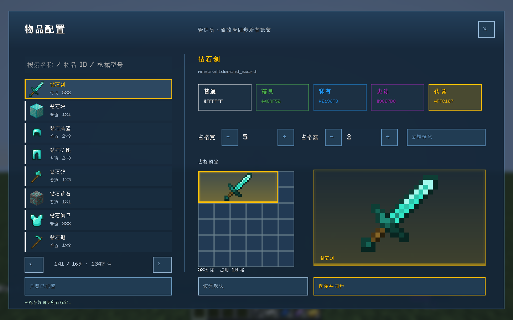
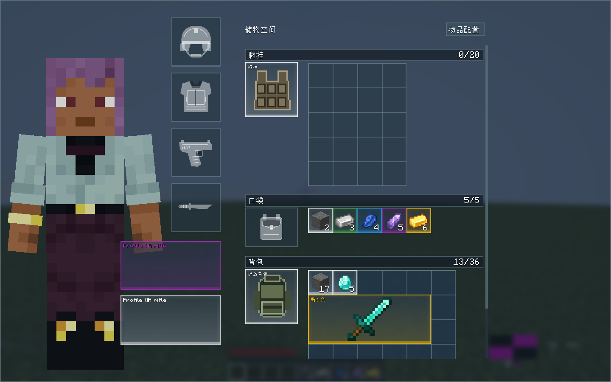

# 物品稀有度与占格配置（1.0.18）

点击战术背包顶部 **物品配置**，或使用 `/tacticalitems`，打开 LDLib2 菜单。管理员（权限等级 2 及以上）可保存；其他玩家可以搜索与预览，服务端拒绝越权保存。

1. 搜索名称、注册 ID 或 GWO 型号，点击左侧物品。打开时优先选中手持物品。
2. 点击五档稀有度，调整宽高（各 1–6 格）。
3. 右侧同时显示实际占格与放大图标；**旋转预览**检查横放、竖放，不改变实际物品。
4. **保存并同步**立即应用到当前世界所有在线玩家并保存；**恢复默认**删除该覆盖，恢复原标签和类别尺寸规则。

| 稀有度 | 颜色 | 色值 |
|---|---|---|
| 普通 | 白 | `#FFFFFF` |
| 精良 | 绿 | `#4CAF50` |
| 稀有 | 蓝 | `#2196F3` |
| 史诗 | 紫 | `#9C27B0` |
| 传说 | 金 | `#FFC107` |

未配置物品默认普通。稀有度用于装备、口袋、胸挂、背包、待整理与已揭示搜刽物品的边框、内部背景光效、名称颜色。多格物品按整体范围绘制；大物品框内显示名称，小格名称在储物空间标题处随指向显示，不启用原版 tooltip。未搜索出的物品不泄露稀有度。鼠标浮图仍只有物品图标，原槽灰色遮罩及绿/红放置预览保持原有表现。

配置按物品注册 ID 应用。GWO 枪械 / 近战还按 `GunData.contentId` 区分具体型号，精确型号优先于基础物品配置。菜单使用已有 GWO 图标渲染器；不改变弹药、附件、数量、名称或其他组件。

尺寸与拖拽、自动旋转、替换、搜刮及服务端放置校验共用规则。更新时优先保留合法根位置，冲突物品重新安置；无法安置的物品完整保存在 **待整理** 区，不删除或掉落。变成多格的口袋物品迁入合法储物区或待整理，离线玩家下次登录同样检查。胸挂独立小袋规则、背包容量不因物品外部占格设置而改变。

草稿不提前影响库存。保存校验权限、尺寸、ID 和修订号；其他管理员修改后，旧请求被拒绝并同步最新规则。更新取消旧拖拽预览，菜单修订号使旧坐标请求失效；断线清理客户端规则。

配置保存于世界主维度 `data/tactical_inventory_item_profiles.dat`，无需手写标签或改 JAR。双端使用 1.0.18，仍需双端 LDLib2 2.2.x。菜单不生成物品。

