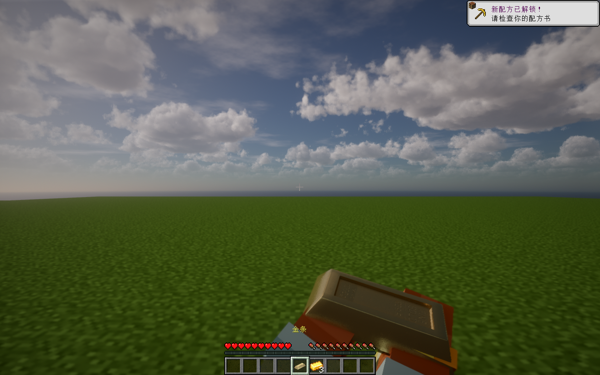
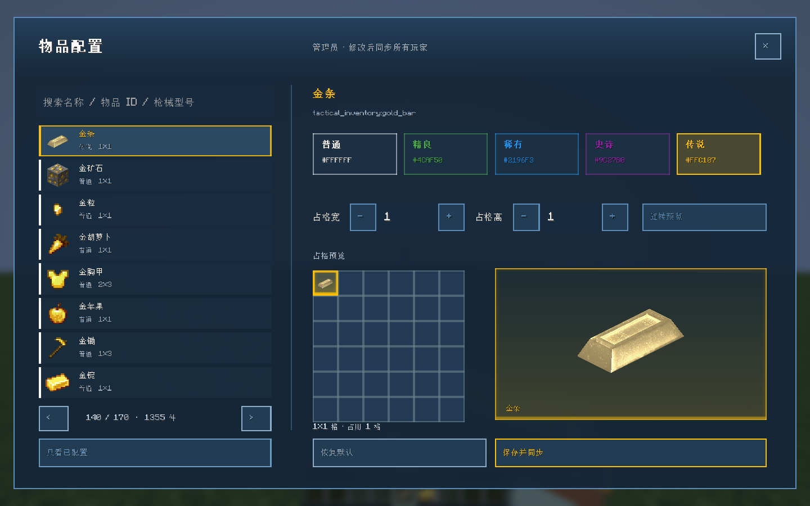

# 战利品模型与检视（1.0.19）

首个物品是 **金条**，注册 ID `tactical_inventory:gold_bar`。它使用用户指定的 Fine Gold Bar / Incg5764 模型，默认传说（金色 `#FFC107`）、占格 1×1、每组 1 个。管理员可在原 LDLib2 物品配置菜单调整品质和尺寸，恢复默认会回到金色品质及 1×1。

## 获取与操作

- 创造模式“工具与实用物品”中取得金条，或使用 `/give @s tactical_inventory:gold_bar`。
- 保险箱破译奖励表增加独立 25% 金条奖励概率，不修改已经生成的箱内内容。
- 放入口袋并选中，自动播放拿出和待机。按 GWO 的 **检视** 键（默认 I），或右键空处，播放约 2.6 秒翻转检视，完成后回到待机。重复输入不会不断重启动作。
- 检视使用玩家自己的皮肤双手，支持左右主手，切换物品、打开菜单、死亡或断线会停止。检视为客户端表现，不生成或消耗物品。
- GUI、地上掉落物和第三人称均使用同一真实模型；GUI 沿用原稀有度边框和背景光效。

## GWO 复用范围

直接调用 `GltfModelCache` 加载 GLB、`AnimationPose` / `GunAnimationCache` 采样内嵌动作，以及 `BufferedGltfModelRenderer.renderBoneMatrices` 绘制 GPU 模型；兼容降级使用 GWO 三角形渲染器。玩家皮肤手臂由 Minecraft 渲染，与 Blender 手腕通道同步。没有把金条注册成枪械，也不写入枪械内容 ID、弹药、附件或全局武器动画状态。

原模型以 PBR 为主，基础颜色相对平坦，刻字/划痕主要位于法线图。Iris 使用基础贴图同名的 `_n` / `_s`，因此提供 LabPBR 法线和金属贴图：XY 沿用原法线，平滑度由粗糙度转换，金为 231。开光影使用原 PBR 颜色与实时材质；GUI / 无光影使用 Blender 烘焙图保留表面细节。该转换依据 [LabPBR 标准](https://shaderlabs.org/wiki/LabPBR_Material_Standard)。

已在实际 GWO Beta1.0 Fix0.5、Iris 1.8.14 beta.1、Sodium 0.8.12 和用户当前 Sundial-Lite 设置的独立实例检查。Iris 确实载入了非默认法线与镜面材质；GPU 绘制和检视测试通过。不同光影包的亮度、反射及 PBR 开关会影响最终外观。

## Blender 源文件

`model-source/gold_bar/gold_bar_inspection.blend` 保存可编辑动作；`gold_bar_animated.glb` 为带材质及动作的完整导出，`animation_authoring.json` 记录 Blender MCP、帧率和时长。原始下载 SHA256、网格和贴图来源记录在 `provenance.json`。

动作由 Blender Lab MCP 在 Blender 5.2.2 内制作，导出抽样 40 fps。构建中去掉 GLB 内重复贴图并将动作起点归零，保留 Blender 的曲线采样。纹理转换与运行时打包脚本位于 `tools/`。模型 CC BY 4.0、代码 MIT，详见 [许可](../ASSET_LICENSES.md)。

