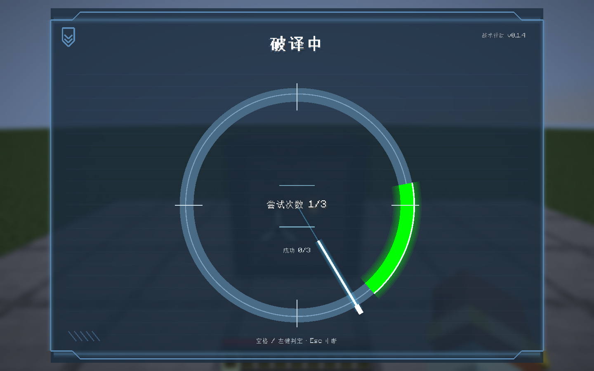

# 战术保险箱破译

靠近未开启的保险箱并看向它，按 **F** 进入 LDLib2 战术破译界面。F 在其他地方继续原有副手功能；已开启保险箱按 F 或右键直接搜刮。

指针从 12 点开始顺时针转动，首轮约 1.5 秒一圈，种子会产生小幅速度变化。空格或左键判定一次；按住空格不会连续提交。成功区初始 60°，一次成功后缩到 45°，两次成功后缩到 30°，指针也逐步加快。

- 累计成功 3 次：解锁、生成箱内奖励，关闭破译界面，播放原 Blender 开门动作后进入搜刮。
- 累计失误 3 次：本轮失败，播放惩罚音效，3 秒冷却后可以重新开始。
- 中心“尝试次数 1/3–3/3”表示当前剩余的失误尝试阶段，成功次数另显示 0/3–3/3。
- Esc、界面被替换、离开 3.5 格范围、死亡、换维度或断线均中断；再开始使用新种子和零进度。

破译期间服务端拒绝移动、攻击/使用、丢弃、副手交换、快捷栏切换及容器操作，GWO 开火、延迟开火、换弹、近战与护甲板入口也被阻止。已经发出的子弹继续原本弹道。此时持续播放可被附近玩家听见的机械噪音。

实际受到伤害会同步约 650 毫秒指针抖动，服务器有 35% 概率直接中断。未中断时显示和判定使用同一抖动函数。界面不会使玩家无敌或取消原伤害。

## 权威与同步

随机种子、阶段开始时间、成功/失败次数、反馈、抖动和修订号是保险箱的 `@DescSynced` 管理字段，通过 LDLib2 描述同步系统传输。界面由 LDLib2 `ModularUIScreen` 和 `UIElement` 渲染树构建，没有原版容器按钮或菜单布局。

客户端只提交会话 UUID、阶段修订号、递增输入序号与点击/取消动作；不提交判定角度、成功标志或奖励。服务端重算实时角度和绿区，拒绝错误会话、过期修订、重复输入、快速连点、越距和隔墙请求。显示按服务器时间校准，输入采用服务端测得、上限 75 毫秒的半程延迟补偿。

未开启的箱子不能通过普通右键绕过破译。一个箱子同时仅允许一名玩家破译；其他玩家仍可通过攻击干扰。

客户端和服务器都需要 LDLib2 2.2.40+（2.2.x）。本版同步字段在服务端也使用 LDLib2。

## 奖励与防重复

奖励来自数据包可覆盖的 `tactical_inventory:chests/safe_decrypted`。默认包含钻石、金锭、绿宝石，以及下界合金碎片/不死图腾/野战背包之一。

原箱内物品保留，每个箱子只生成一次。箱子已满时奖励保存在箱内待存列表中，腾出槽位后自动补入；待存奖励也写入存档，破坏箱子时随内容掉落。已解锁保险箱掉落的物品携带奖励标记，重新放置保持已开启，不能用拆放刷新奖励。

成功后继续上一版永久开启行为，所有玩家可通过开门外观知道它已被访问。

