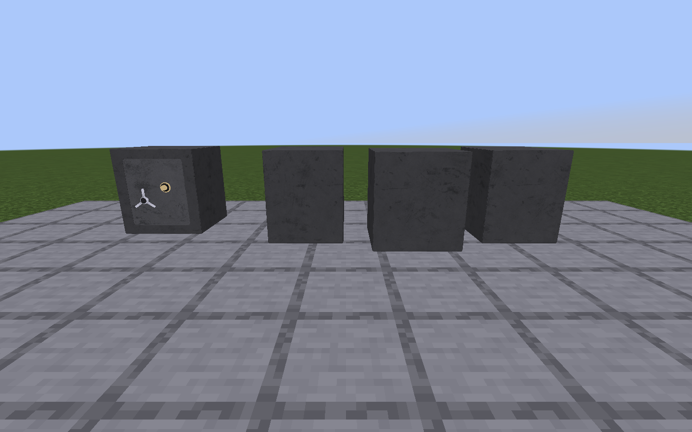
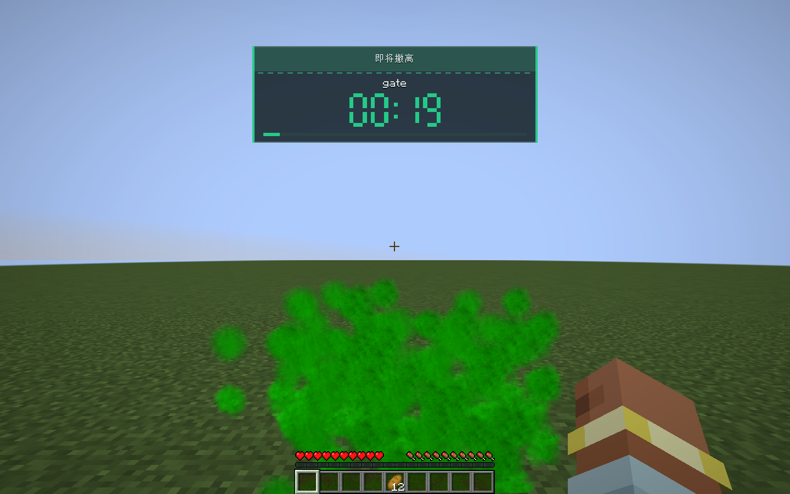
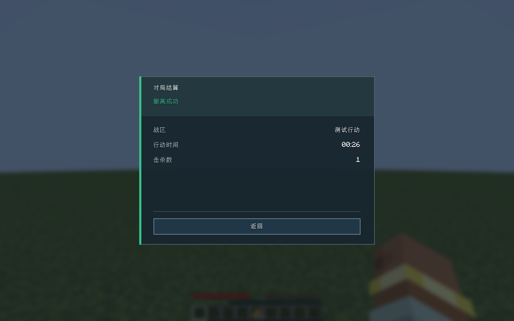

# v1.0.20 验证

发布 JAR 使用 NeoForge 21.1.251、LDLib2 2.2.40、Photon 2.2.7 和 GWO 内部版本 2.12.87 验证。

## 金条模型、Blender 动作与 PBR

- 69 项单元测试通过，新增拿出 / 待机 / 检视时序、连续输入节流和取消检查。
- 实际 Blender Lab MCP / Blender 5.2.2 导出三个动作及独立手腕通道，可编辑工程保存成功；原模型许可 CC BY 4.0。
- 原生 GWO Fix0.5 加载模型、GPU 渲染与内嵌曲线；真实 GWO 检视键事件、右键、左右主手、品质覆盖/恢复默认及多格迁移通过。
- Iris 1.8.14 beta.1 / Sodium 0.8.12 / 用户 Sundial-Lite 设置：真实法线、镜面纹理载入（不是默认单色贴图），GPU 绘制未进入降级分支。
- 无光影实例与 LDLib2 GUI 使用 Blender 2K 材质烘焙图，完成实际截图检查；原始 PBR 与 LabPBR 编码分别保存。
- 金条为普通独立战利品，无枪械 ID / 弹药；检视不改变服务端物品数量。

## 稀有度和占格配置

- 66 项单元测试，新增五档精确颜色、尺寸边界、GWO 型号优先级与非法 ID 检查。
- 原生客户端与集成服务器：`/tacticalitems` 和背包按钮打开 LDLib2 菜单，实际点击保存五档配置，草稿不影响真实规则。
- GWO 型号分别配置，弹药不变；菜单占格 / 放大图标 / 中文输入框完成截图检查。
- 服务端拒绝非管理员、非法尺寸及旧修订；配置 NBT 保存回读一致。
- 6×6 扩大后原有数量 / 名称完整保留，口袋物品迁出、待整理保护、已打开搜刮布局刷新；仅改稀有度不移动原容器根位置。
- 恢复默认与断线清理；发布包排除原生测试类。原生测试源码 `src/profileSmoke/java`，参数 `-PprofileSmoke`。

## LDLib2 破译

- 62 项单元测试通过，新增种子复现、跨 12 点弧区、匀速时钟、加速缩区与伤害抖动检查。
- 实际 F 映射打开 `ModularUIScreen`/LDLib2 渲染树，保险箱 `@DescSynced` 字段确实通过管理字段系统传输。
- 真实点击包覆盖三次失误、冷却重开、三次成功、奖励生成、原内容保留、持久化奖励标记和永久开门。
- 错误会话/修订拒绝、取消后延迟同步不重开界面、实际伤害与范围中断通过。
- 服务器实际处理移动、快捷栏包和 GWO 延迟开火入口时均拒绝；解除破译后无锁残留。
- 已满保险箱的待存奖励保存回读，已解锁箱的掉落物携带防刷新标记。
- 独立检查位于 `src/crackSmoke`，仅 `-PcrackSmoke` 编译；摘要见 [crack-runtime-validation.txt](crack-runtime-validation.txt)。


## 保险箱模型

- 58 项单元测试通过，其中包含新箱关闭、16 tick 动作单调插值和已开启箱加载/保持开启检查。
- Blender 5.2.2 的实际 MCP 场景含门铰链动作、4 个 mesh 和原 PBR 材质；可编辑项目、动画 GLB、闭合 OBJ 与 65 个实际曲线样本已保存。
- 实际服务器交互先同步 `open=true` 并延迟搜刮；客户端渲染中间动作帧，完成后打开原界面。关闭界面、保存/恢复和后续访问均不关门或重播。

- 作者 GLB 原始 4 个 mesh、5461 个三角形及未重采样 PNG 已接入；实际四向 BakedModel 与物品模型均加载完整几何，粒子纹理引用新贴图。
- 原生客户端截图已验证箱体、箱门、锁具和把手、四方向世界放置及物品栏显示。
- 朝向旋转/镜像、拟合碰撞边界、27 格保存回读、原 LDLib 搜刮屏幕及破坏后的内容掉落均通过。
- 检查在 `-PsafeSmoke` 独立测试世界运行，原生摘要见 [safe-runtime-validation.txt](safe-runtime-validation.txt)。测试代码不进入正式 JAR。
- 模型来自 avhatar 的 Simple Safe，CC BY 4.0；许可和改动说明随安装包分发，详见 [ASSET_LICENSES.md](../ASSET_LICENSES.md)。



## 对局检查

- 55 项单元测试通过，其中新增 11 项覆盖完整 400 tick 撤离、离区/换区重置、终结幂等、击杀与方形范围。
- 独立原生客户端及集成服务器检查通过：命令入场、真实出生传送、作者原始绿色循环烟雾的实际粒子和变换、顶部倒计时与结算屏幕。
- 默认 20 秒连续停留，离区重置，重入重新计时；正在对局时不能确认结果，伪造会话 UUID 被拒绝。
- 撤离保留战利品、返回大厅；结算被其他屏幕替换或再次死亡后可以恢复，已提交结果不被第二次死亡覆盖。
- 死亡在 keepInventory=false/true 两种配置均保留 GWO 近战完整组件、储物区斧头，实际掉落口袋物资、背包、背包物资和护甲；正常复活后回大厅结算。
- 模组取消死亡并复活时不提交结果、不掉落物品；击杀统计仅发生于实际接受的死亡路径。
- 对局配置及结果 NBT 回读，重启中断在途会话；断线/重登幂等、旁观切换终止参与、资源重载与断线清理烟雾均通过。

原生对局测试位于 `src/raidSmoke/java`，仅在 `-PraidSmoke` 编译。首次使用测试目录时设置 `run-raid-smoke/options.txt` 的 `onboardAccessibility:true`，绕过测试实例的首次启动引导，然后运行：

```powershell
./gradlew.bat -PraidSmoke runClient
```

它创建独立临时世界并隔离测试窗口的物理输入，不修改玩家世界。验证摘要见 [raid-runtime-validation.txt](raid-runtime-validation.txt)。





## 自动检查

- 44 项单元测试通过，包含 300 个小布局与独立穷举算法对照。
- 14 类原生客户端与集成服务器检查通过，摘要见 [runtime-validation.txt](runtime-validation.txt)。
- 真实鼠标与网络检查覆盖多格物品的全部 10 个抓取格、20 次快速往返、旋转、拆分、保存恢复、死亡掉落、搜刮访问及跨容器移动。
- 替换检查覆盖多件回填、移走物自动旋转、无解与部分堆叠的原子拒绝、满堆替换、装备容量、物理槽数、隐藏物品保护，以及数量、弹药、名称和其他组件保留。
- 背包单元测试源码位于 `src/test/java`；原生背包检查位于 `src/smoke/java`，仅在 `-PbagSmoke` 模式编译。

## 运行检查

先按 [本地依赖说明](../libs/README.md) 准备 GWO 与 JDK 21，将要验证的兼容模组放入被 Git 忽略的 `run-ui-smoke/mods`。

```powershell
./gradlew.bat test runClient -PbagSmoke
```

检查会在独立 `run-ui-smoke` 目录创建临时世界，并隔离测试窗口的物理输入；仍调用实际 Screen、MouseHandler 和网络包路径。正式打包需去掉检查参数：

```powershell
./gradlew.bat clean build
```

## 验证边界

GWO 测试枪通过其公开接口注册，不读取受保护模型。测试枪图标可能为空，普通工具图标用于验证 90° 旋转；生产模型渲染函数沿用正常 GWO 路径。

原版箱子、双箱、陷阱箱、木桶和本模组保险箱属于当前支持范围。第三方专用容器的任意过滤规则不属于预览兼容范围，服务端会拒绝非法写入。复杂回填有 250000 节点搜索上限，耗尽时不会提交。

尚未实测远程专用服务器、两名真实联网玩家并发或完整光影组合。
